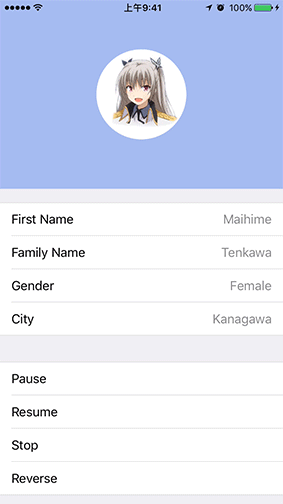

# iOS-10-ViewPropertyAnimator

预览



在iOS 10中苹果推出了一系列新的动画API，与以往的相比，可以非常容易实现动画的中断、反转以及重置等操作

### UIViewPropertyAnimator

UIViewPropertyAnimator对象储存了相关的动画信息，你可以随时对其进行操作来改变动画的执行状态

```
/*初始化方法 需要手动开启动画*/
- initWithDuration:curve:animations:
- initWithDuration:controlPoint1:controlPoint2:animations:
- initWithDuration:dampingRatio:animations:
- initWithDuration:timingParameters:

/*创建对象后立即执行动画*/
+ runningPropertyAnimatorWithDuration:delay:options:animations:completion:

/*添加动画*/
- addAnimations:

/*添加动画完成后的操作*/
- addCompletion:
```


```
interruptible    /*动画是否可以Pause或Stop*/

userInteractionEnabled    /*动画执行过程中是否可以干预*/
```

### UIViewAnimating

UIViewAnimating协议为UIViewPropertyAnimator对象提供了可控制动画的方法

UIViewAnimatingState有三种：Active、Inactive、Stopped

Animator的最初状态为Inactive，当调用startAnimation或pauseAnimation方法时，会变为Active，而完成动画后又会回到Inactive的状态  
在Active下调用stopAnimation:方法并传入YES将清除所有动画并设为Inactive状态，如果传入NO会切换至Stopped状态，随后可调用finishAnimationAtPosition:完成剩余动作

需要注意，对Inactive的Animator使用pauseAnimation方法会变为Active状态并暂停动画

```
/*开始、恢复动画*/
- startAnimation

/*暂停动画*/
- pauseAnimation

/*停止动画*/
- stopAnimation:

/*结束动画*/
- finishAnimationAtPosition:
```
使用这些方法时应该尽量按照状态转换的流程，不要在Stopped状态下调用Start/Pause方法

```
fractionComplete    /*动画的执行程度，0到1之间*/

reversed    /*若设为真，则反向执行动画*/

running    /*查看是否在执行动画，返回NO则动画被Paused或Stopped*/
```

### UISpringTimingParameters

看到Spring就知道这是来用模仿弹簧动画的了  
你可以这个类来创建一个拥有特定物理属性的弹簧

```
/*初始化方法*/
- init
- initWithDampingRatio:
- initWithDampingRatio:initialVelocity:
- initWithMass:stiffness:damping:initialVelocity:
```
DampingRatio为1时没有任何振动动画，越接近0阻尼越小振动次数越多  
DampingRatio其实就是由这个公式计算而来：damping / (2 \* sqrt (stiffness \* mass))

Mass：质量，必须大于0  
Stiffness：刚度系数，值越大，弹簧作用在物体的力越大  
Damping：阻尼系数，值越大，振幅越小，振动次数越少  
InitialVelocity：初始速率，实质是向量，因为带方向
